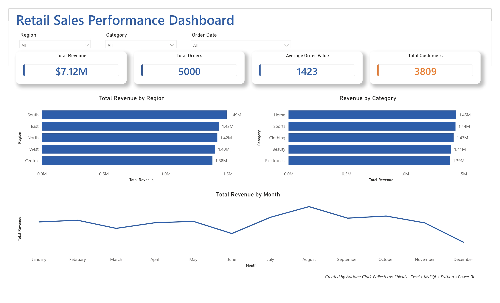

# 📊 Retail Sales Analysis (SQL Project)

## 🔍 Overview

This project analyzes retail sales data using MySQL to uncover insights about customer behavior, product performance, and revenue trends.

The dataset was cleaned in Excel and imported into a relational database. SQL queries were used to perform joins, aggregations, and segmentation.

---

## 🛠 Tools Used

* MySQL
* Microsoft Excel
* Power BI

---

## 🤖 Use of AI

AI tools were used to assist in:

* Created realistic synthetic dataset
* Built logic for calculating percentage rates
* Utilized SQL queries using JOINs, CASE statements, subqueries, and aggregations to extract and analyze data 
* Debugging errors in SQL and DAX
* Structuring calculations for Power BI

All outputs were manually validated and refined to ensure accuracy and reliability.

---

## 🗂 Dataset

The project includes:

* Customers
* Products
* Categories
* Orders
* Order Items

---

## 📈 Key Analysis

### 1. Top Customers

Identified highest spending customers using JOIN and SUM

### 2. Revenue Analysis

Calculated total and category-level revenue

### 3. Product Performance

Determined best-selling products

### 4. Customer Segmentation

Used CASE WHEN to classify customers

---

## 💡 Key Insights

* Electronics generated the highest revenue
* Top customers contributed most of the sales
* Some customers had no purchases (identified using LEFT JOIN)
* Sales trends vary by date

---

## 🧠 Skills Demonstrated

* SQL JOIN (INNER, LEFT)
* GROUP BY and aggregation
* IFNULL handling
* Data cleaning in Excel
* Relational database design

---

## 📊 Future Improvements

* Build interactive dashboard in Power BI
* Add more data for deeper insights
* Automate data pipeline

---

## 📁 DASHBOARD PREVIEW

---

## 👤 Author

Adriane Clark Ballesteros  
Data Analyst Trainee

* 🔗 GitHub: https://github.com/acbshields12

---
